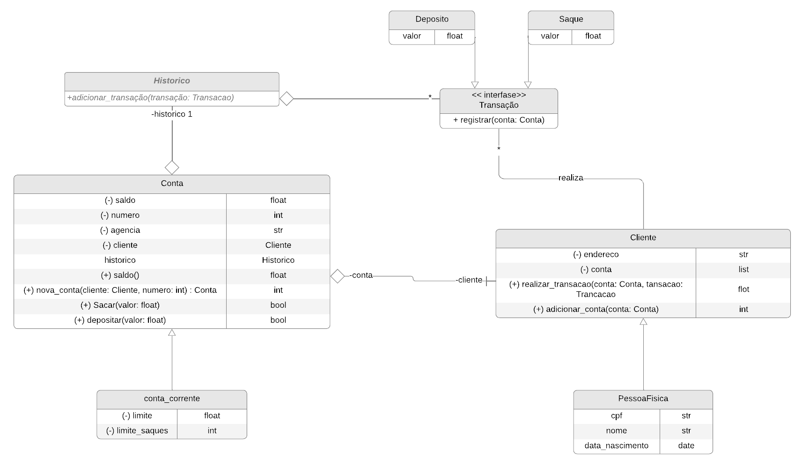

# Sistema Bancário em Python 🏦🐍

Este projeto foi desenvolvido como parte dos desafios de código do **Bootcamp DIO, NTT DATA - Engenharia de Dados com Python**. Ele oferece uma oportunidade prática para aplicar conceitos de programação em um contexto de software financeiro básico.

---

## 📍 Introdução
O **Sistema Bancário com Python** é uma aplicação simples que simula operações bancárias fundamentais. Com melhorias e correções aplicadas, o sistema agora proporciona uma experiência mais funcional e robusta.

## Sistema Bancário em Python 🐍



---

## 🎯 Objetivo Geral
Desenvolver um sistema bancário capaz de realizar as seguintes operações:
- **Saque**
- **Depósito**
- **Visualização de Extrato**
- **Criação de Novos Usuários e Contas**
- **Listagem de Contas**

---

## 🚀 Funcionalidades

### 📌 Depósito
- Permite realizar depósitos de valores positivos.
- Os depósitos são registrados no histórico e exibidos no **Extrato**.
- A entrada de valores foi corrigida para evitar erros ao manipular dados numéricos.

### 📌 Saque
- Permite até **3 saques diários** com limite de **R$ 500,00 por saque**.
- Todos os saques são registrados e exibidos no **Extrato**.
- Valores inseridos como strings são tratados adequadamente para evitar falhas.

### 📌 Extrato
- Exibe o histórico completo de transações da conta.
- Melhoria na verificação de extrato vazio e formatação de valores monetários.
- O saldo é exibido com duas casas decimais para maior precisão.

### 📌 Criação de Usuário
- Permite cadastrar novos usuários com os seguintes dados:
  - Nome completo
  - CPF
  - Data de nascimento
  - Endereço
- Correção na validação e armazenamento do CPF.

### 📌 Criação de Conta
- Cria uma nova conta vinculada a um usuário existente.
- Valida o CPF antes de criar a conta.
- Corrigido erro no registro de contas utilizando o método `append()` corretamente.

### 📌 Listagem de Contas
- Lista todas as contas criadas, exibindo:
  - Agência
  - Número da conta
  - Nome do titular

---

## 📚 Nota Importante
O código foi ajustado para garantir maior funcionalidade e evitar erros. As principais melhorias incluem:
- **Correções de comparação e formatação**: Evitar conflitos entre diferentes tipos de dados, como comparar strings com números.
- **Tratamento de valores numéricos**: Conversão automática de entradas para o tipo `float` antes de operações financeiras.
- **Uso correto do método `append()`**: Garante que novos dados sejam adicionados às listas existentes sem sobrescrever valores.

---

## 🛠️ Tecnologias Utilizadas
- **Python**: Linguagem principal do projeto.
- **ABC (Abstract Base Classes)**: Para a definição de estruturas abstratas como transações.

---

## 📂 Estrutura do Projeto
```plaintext
Sistema_Bancario/
├── main.py          # Arquivo principal do sistema
├── classes.py       # Definições de classes e métodos
├── utils/           # Funções auxiliares (futuro)
└── README.md        # Documentação do projeto
